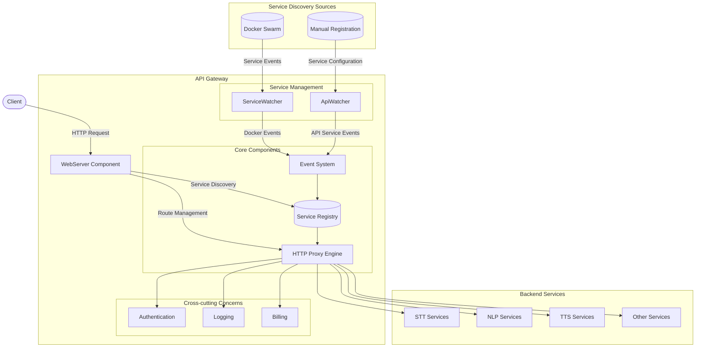

# Linto API Gateway (origines)

```jsx
State: (plus ou moins) complété
```

> Version legacy du service LinTO API Gateway.

Dépot : [https://github.com/linto-ai/linto-api-gateway/tree/next](https://github.com/linto-ai/linto-api-gateway/tree/next)

Description : Passerelle API (gateway vers services proxifiés) conçue selon une architecture modulaire (à base de composants fonctionnels : ApiWatcher, WebServer, ServiceWatcher).

Licence : AGPL-3.0-or-later

**Technologies:**

- NodeJS
- Server Express + Swagger
- Dockerode
- SQLite
    - Default storage : memory
- Logs
    - Utilisation de `debug` (DEBUG=*) sur sortie standard

**Orchestration :**



**Composants :**

Les composants héritent de `Components` qui étend `EventEmitter`.

Liste (chargée dans cet ordre, cf `.envdefault`):

- ServiceWatcher : gestion des services dockers et réaction aux évènements
- ApiWatcher : gestion des services APIs enregistrés en SQL (`lib/list-service.js`)
- WebServer : exposition des APIs services et routage des requêtes HTTP

**Concept de “services” :**

Il existe 4 types de services exposés par l’API-gateway :

- transcription :
    - if image contains `linto-transcription-service`
    - if image contains `linto-platform-transcription-service`
- nlp : if image contains `nlp`
- tts : if image contains `tts`
- services : dans les autres cas

## Lifecycle

1. L’application démarre par `Ctl::init()` : méthode synchrone :
    1. Chargement des éléments de `config.js` 
        1. Chargement du `.env` 
            1. ⚠️ Manque appel `dotenv.config` pour charger les valeurs du `.env` (seules les valeurs de .envdefault ou celles SET en env sont utilisées)
        2. Chargement de `.envdefault` 
        Defaults :
            1. SWAGGER_HOST=http://localhost
            2. SAAS_API_GATEWAY_HTTP_PORT=80
            3. COMPONENTS=ServiceWatcher,ApiWatcher,WebServer
            4. SQLITE_DB_MODE=memory
            5. EXPRESS_SIZE_FILE_MAX=500mb
            6. ALIVE_TIMER_SERVICE=5 # 300 secondes
        3. La configuration est définie dans les `process.env` 
        4. La configuration DOIT crash si des valeurs sont indéfinies
    2. Initialisation des composants (`COMPONENTS`) par reduction de la liste et appel de `Ctl::use`.
        1. ⚠️ `Ctl::use` est `async` mais les constructors des components sont synchrones.
        2. Chaque composant étend la `class Component` ET chaque `constructor` retourne un appel à `Component::init()` 
            1. `Component::init()` recherche les fichiers composants/controllers qui sont `require` 
            2. ⚠️ Bug sur la logique de détection (code incorrect par rapport au commentaire, risque d’exec multiple des contrôleurs) + absence de `await` sur certains controllers asynchrones.
        3. ServiceWatcher
            1. Composant de gestion des services dockers. La class bind les méthodes `discovery`, `available` , `list` .
            2. Appel de `ServiceWatcher/watcher.js` 
                1. Appel async `docker.getEvents()` 
                2. Handler sur les évènements
                3. Pour tout évènement, création d’un `service = new Service(serviceName)`
                    1. Contient les méthodes : `setMetadata(JSONServiceInspect)` , `isEnabled()`, `extractEnv(dockerEnv, searchedKey)`, `setupMiddlewareSettings(stackLabel)`. 
                4. Filtre sur les appels de type `create` , `update` , `remove` 
                    1. Si `create` ou `update` :
                        1. Appel async `docker.getService(id).inspect()`  
                        2. Appel à `service.setMetadata()` avec le retour de l’inspect
                            1. Assigne les propriétés serviceInspect à `service.label` et `service.stack`
                            2. Si `linto.gateway.endpoints` n’existe pas : retourne erreur `ServiceSettingsError` 
                            3. Assigne les endpoints à `this.label.endpoints` 
                        3. Si `service.isEnabled` et si `ServiceWatcher::available(service)` 
                            1. Si `create` : emit event
                            2. Si `update` : si *isEqual(prev.PreviousSpec.Labels, next.Spec.Labels) == false*. : emit event
                    2. Si `remove` et `serviceLoaded` : emit event
        4. ApiWatcher
            1. Composant d’observabilité des services apis. La class bind les méthodes `available`, `list`, `registry`, `remove` 
            2. Initialise une boucle d’appel (`setInterval`) chaque 5 minutes à méthode `available` 
                1. Récupère la liste des services (`sql::getAllServices`)
                2. Effectue un appel à `service.healthcheck` (ou [`service.host`](http://service.host) si absent)
                    1. Si erreur : emit `api-remove` (event handle par WebServer/eventsFrom/api-remove : suppression du service en db + suppression des routes express)
        5. WebServer
            1. Composant destiné à la gestion du routage HTTP (express).
            2. ⚠️ Pas de vérification CORS (wildcard)
            3. Chargement du router via require (class Router)
                1. Route `/gateway/healthcheck` définie (retour : ‘200 ok’)
                2. Routes `/gateway/services/` :
                    1. Méthode `POST` : `registry` 
                        1. Appel `AppWatcher::registry(req.body.type, req.body)`
                            1. Vérifie si le service existe en DB (si oui: void)
                            2. Sinon ping des endpoints et event `api-create`
                    2. Méthode `DELETE` : `remove` 
                    3. Méthode `GET :scope` : `list`
                    4. Méthode `GET` : `list` 
            4. Initialisation des fonctions `controllers/eventsFrom/*` 
                1. Si `ApiWatcher:api-create` : insert service sql et création des routes
                2. Si `ApiWatcher:api-remove` : suppression sql et suppression des routes
                3. Si `ServiceWatcher:service-create` : création des routes et assignation du service sur objet `servicesLoaded` 
                4. Si `ServiceWatcher:service-remove`: suppression des routes et suppression du service sur l’objet
                5. Si `ServiceWatcher:service-update` : remplace les routes et l’élément dans objet
    3. Initialisation terminée
        1. SQL ouvert
        2. Express écoute

## Composants

### ServiceWatcher

Surveille et découvre automatiquement les services Docker exploitables basés sur les labels (`Spec.Labels`). Le service frontend (`linto-studio/studio-frontend`) exploite le retour de API_GATEWAY via studio-api qui fait proxy et call `GET services`. 

**Fonctionnalités :**

1. Ecoute des évènements docker (watch) : se connecte au socket docker et surveille les évènements de type “service” (crud)
2. Analyse des metadonnées et construction de class Service.
3. Vérifie si le service est configuré pour être exposé via l’API Gateway (check linto.gateway.enable)
4. Configuration des endpoints pour proxifier les requêtes
5. Emet les évènements : service-create, service-update ou service-remove.

**Logique :**

- Se connecte sur l’instance docker locale (socketPath: `/var/run/docker.sock`)
- Surveille les évènements dockers (création, update, suppression)
- Sur la création d’un service la `class Service` est initialisée
    - [`this.id](http://this.id) = serviceInspect.ID`
    - `service.setMetadata(serviceInspect)` extrait les informations à partir des labels `Spec.Labels` définis dans l’objet `serviceInspect`:
        - `linto.gateway.enable` DOIT ÊTRE `true` (sinon le service n’est pas initialisé)
        - Si `!stackLabel['linto.gateway.endpoints` (undefined) : *throw ServiceSettingsError*
        - Sinon : `linto.gateway.endpoints` traité par `setupMiddlewareSettings(stackLabel)`
            - Initialisation des endpoints `endpoints = {}`
            - Comma-split et parcours des endpoints stockés dans `stackLabel['linto.gateway.endpoints]``
            - Pour chaque endpoint :
                - Etend `endpoints` avec un objet `{ middlewares: [], middlewareConfig: {} }`
                - Créé un `prefixLabel =` `‘linto.gateway.endpoint.${endpoint.repl(’/’, ‘‘)}`
                - Parcours des labels (`stackLabel` ), pour chaque `prefixLabel` :
                    - Si `label includes prefixLabel` :
                        - Décomposition du `prefixLabel` (dot-split) :
                            - `linto`
                            - `gateway`
                            - `endpoint`
                            - `endpointName`
                            - `middleware`
                            - `middlewareName`
                            - `middlewareConfigKey`
                        - Si on découvre le middleware (`!endpoints[endpoint].middlewareConfig[middlewareName] && middlewareName`) on initialise `endpoints[endpoint].middlewareConfig[middlewareName] = {}`
                        - Si `middlewareName undefined` :
                            - *⚠️cas très étrange et pas très clair (utilisation de `endpoints[’/’ + endpointName]` au lieu de `endpoints[endpoint]` )*
                        - Si `middlewareConfigKey` existe :
                            - ⚠️ warn : *utilisation de `endpoints[’/’ + endpointName]` au lieu de `endpoints[endpoint]`*
                            - tente de parser la valeur comme JSON, si échec : stock le rawtext.
        - `linto.gateway.port` contient le port du webserver du service
        - `linto.gateway.scope` PEUT exister (liste comma-separated)
        - `linto.gateway.desc` PEUT ÊTRE au format JSON (fallback text)
        - `com.docker.stack.image`image (facultatif)
        - `com.docker.stack.namespace` est associé à `this.stack.namespace`
            - Possible bug : [`this.stack.](http://this.stack.name)name == this.stack.namespace` (line 42-43)
        - `this.host` est associé à `this.stack.namespace`
        - Si `linto.gateway.port` existe dans `Specs.Labels` , la valeur est concat à `this.host`
        - Si le service est de genre `transcription` :
            - Le service peut contenir `Spec.TaskTemplate.ContainerSpec.Env` :
                - seules les envVars `LANGUAGE` , `MODEL_QUALITY` , `ACCOUSTIC` , `MODEL_TYPE` sont utilisées.
            - Une requête `GET this.host/list-services` est effectué
                - `data.diarization: object` est espéré
                - `data.punctuation: object` est espéré

### ApiWatcher

Méthode de healthcheck sur les Services (contient du code à destination du management de services depuis le composant WebServer, ex: api-registry)

**Fonctionnalités :**

1. Découverte des services via SQL
2. Surveillance de la disponibilité des services (toutes les 300 secondes, healthcheck sur endpoint).

**Logique :**

1. Passé 5 minutes, toutes les 5 minutes, execution de `availableService()` 
    1. Recouvre les services depuis la bdd
    2. Pour chaque service :
        1. Si `service.healthcheck` existe : défini `ping` 
        2. Sinon `ping = service.host`
        3. Requête `GET ping` 
            1. Si succès : rien
            2. Si échoue : event `api-remove`

### WebServer

Coeur de l’API Gateway : composant exposé (http) qui reçoit, traite et redirige les requêtes HTTP vers les services appropriés. Une documentation swagger est fournie (mais n’est pas enrichie par les services exposés).

## Base de données

Système de stockage SQLite (default: memory ⚠️)

Fichier utile : `lib/sqlite/index.js` 

### Table services

Définition:

1. id
2. name
3. serviceName
4. host
5. healthcheck
6. label
7. type (enum: transcription, nlp, tts, services)
8. accoustic
9. model_quality
10. model_type
11. language